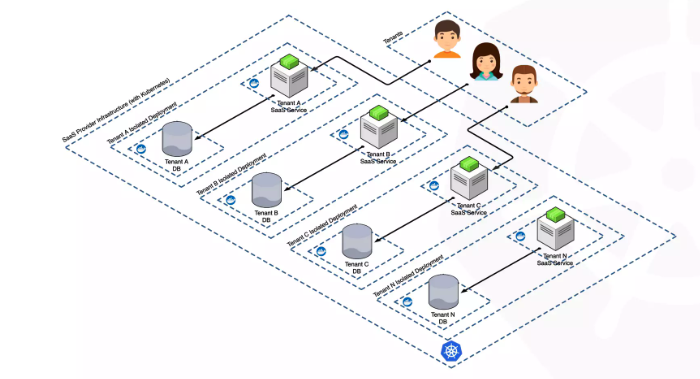

# Multi-tenant SAAS app on kubernetes

In Kubernetes, multi-tenancy refers to the sharing of a cluster and its control plane by a number of workloads or applications. Whereas in single-tenancy, a single workload/application utilises the whole Kubernetes cluster.

## Challanges

#### Tenant Isolation 
 Challange- Rather than using individual kubernetes cluster for each tenant, In case of one single cluster for multiple tenants is amajor channalge. 
 
 Solution- Kubernetes namespace can be utilized to have tenants sit in their perticular namespace. Some other advanced options can also be utilised like kiosk.

#### Network Isolation 
 Challange- Isolating the tenants from one another is a challange. Resources from one tenant should not be able to talk to the resources from other tenant. The system needs to be protected against any kind of attacks and should only be utilised by trusted tenants.
 
 Solution- Network policies. For Advanced use-cases, network policies in combination with any service mesh like Istio can be used. Another option is vcluster.

#### Resource Isolation
 Challange- A Noisy neighbour can consume you all resources, so need some solution to properly restrict the resources.
 
 Solution- Implement Quotas on namespace level and also define resource limit and request for pods.


#### Users Access Control
 Challange- Depending on the scenareo, If internal teams needs to restricted, then a user authentication based on tenants needs to be in place. OR If we have some automatic on-boarding service by which customer can provision the tenants, the authentication mechanisam is needed to handle users onboarding request also.
 
 Solution- User RBAC for internal team for proper acces control. Create Service role and role binding for access on namespaces, and for a cluster-wide access using ClusterRole and Clusterrolebinding.

#### Hardware Isoltaion 
 Challange- In some cases, its required to have specific workload scheduled on specifc choosen hardware. For instance- in case of tiering system, in case of compliance requirements.
 
 Solution- Taints and Toleranats in combination with nodeAffinity is very useful to schedule required workload to specific node.

 


## Steps to setup kuberentes locally for multi-tenant  workloads.
Components
- Minikube
- Nodes- 2
- Tenants- 2
- Network plugin- Calico 


## Details about the solution and components used.

* The Solution is creating a 2 nodes minikube cluster with calico as plugin for network policies. 
* Tenants are isolated by Kubernetes Namespaces.                                                                 
* For network traffic isolation, network polcies are being used.                                              
* For resource assignemnt and control Resource Quotas at namespaces is implemented, along with resource Limits and requests for the pods.            
* Kubernetes Taint Tolerantas in combination with nodeAffinity is being used to schedule pods from tenant 2 on node2 only.                    


#### Kubernetes manifest files details
- web.yaml =>  Wordpress deployment and service.
- db.yaml => Mysql deployment and service.
- secret.yaml => Secret for mysql DB user password.
- quota.yaml => Creating quotas for namespace.
- network-deny-all.yaml => Network policy to deny all traffic by default.
- allow-db.yaml => Allowing only webservers connection to database pod.


1. #### Start minikube with 2 nodes and Calico as plugin for Network Policies.
- Run the below command
```
minikube start --nodes 2 --network-plugin=cni --cni=calico 

kubectl -n kube-system set env daemonset/calico-node FELIX_IGNORELOOSERPF=true 
```
- If kube-proxy pods doesn't start properly.(Troubleshooting)

- `kubectl edit configmap kube-proxy --namespace=kube-system` and change the value of maxPerCore: to 0 under -conntrack.


2. #### Add lables and taint to node2.
- Run the below command
```
kubectl label nodes minikube-m02  size=Large

kubectl taint nodes minikube-m02 size=Large:NoSchedule
```


3. #### Create namespaces
- Run the below command from root of repo.
```
kubectl apply -f namepace.yaml
```

4. #### Launch tenant1
- Navigate to tenant1 directory and deploy the manifests.
```
cd tenant1
kubectl apply -k ./
```
- It'll launch everything in namespace1.
- Verify if everything is workig fine.
```
kubectl get all -n tenant1
```
- Test the app by forwarding port to local system.
```
kubectl port-forward svc/wordpress 8088:80 -n tenant1
```
5. #### Launch tenant2
- Navigate to tenant1 directory and deploy the manifests.
```
cd tenant2
kubectl apply -k ./
```
- It'll launch everything in namespace1.
- Verify if everything is workig fine.
```
kubectl get all -n tenant2
```
- Test the app by forwarding port to local system.
```
kubectl port-forward svc/wordpress 8088:80 -n tenant2
```


## Scope of Improvements 

- Servicemesh with network policies can be used to improve the mesh and security. Istio has great compatibility with calico, which can make the solution more powerful as istio enables the communication between services and pods secure over mTLS using envoy proxy and improves the traffic behaviour, routing, retry logic and failover.
- Ingress can used on top of service to improve the routing and services behaviour. Usefull in case of cloud solutions.
- vCluster can be introduces, as it provides its own api within namespace and give more secure approach and granularity.
- Helm should be used in production for deployment. It helps in keeping history and gives granularity to create the solution reusable by adding variables and values.
- Monitoring and Observability using any platform like prometheus, grafana, datadog etc enhances the strength of system by helping admins to proactively improve the solution. 

```
